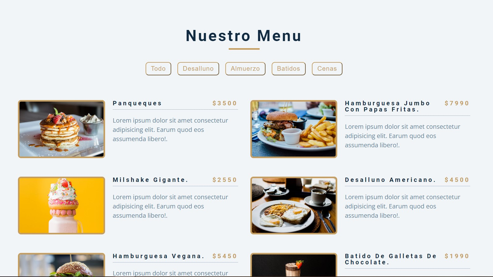

# Menu de restaurante 
un menu e restaurante que presenta 4 categorias, Desalluno, Almuerzo, Batidos y Cenas.
donde puedes ver todas a la ves o separados solo por la categoria en especifico que quieras ver. 

  
    
  
    
  
  

