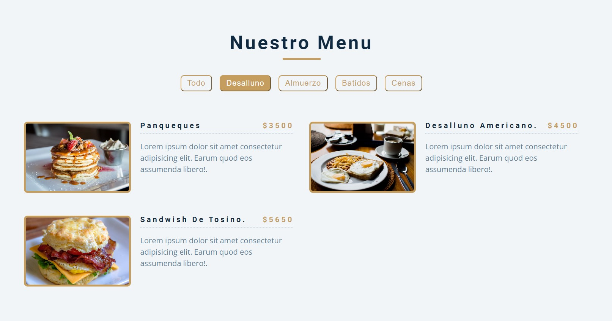

# Menu de restaurante 
un menu e restaurante que presenta 4 categorias, Desalluno, Almuerzo, Batidos y Cenas.
donde puedes ver todas a la ves o separados solo por la categoria en especifico que quieras ver. 

  
    
  
    
  
  

## ¿Cuál es el fin de este proyecto?
Este proyecto se creó con fines de aprendizaje usando HTML, CSS y JavaScript. es un projecto usando a modo de aprendisaje para 
la creacion de un Menu con capacidad de fltrar por categorias 

## ¿Puedo Probarlo en Linea? 
Si, Puedes probarlo en linea haciendo click [aqui](https://carlosorellana00.github.io/Menu-Restaurante/)

## Capturas de Pantallas
 vistas de ejemplo

  

  

 

## Referencias y Agradecimientos a: 
- [Video Original-> Build 15 JavaScript Projects - Vanilla JavaScript Course](https://www.youtube.com/watch?v=3PHXvlpOkf4&t=421s)
- [Canal del Autor -> freeCodeCamp.org](https://www.youtube.com/c/Freecodecamp)
- [Github del Proyecyo ->](https://github.com/john-smilga/javascript-basic-projects)

